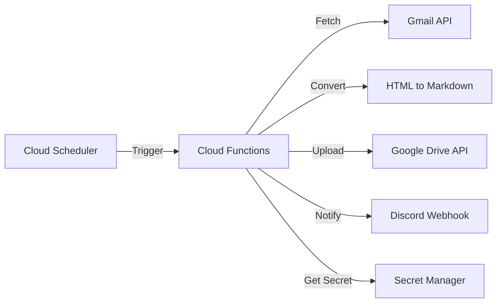

# 設計書

## アーキテクチャ概要

Google Cloud Functions を核としたサーバーレスアーキテクチャ。Cloud Scheduler が定期的に起動し、Gmail API からメールを取得、Markdown 変換後、Drive API でアップロードを行う。



## 認証戦略

### Gmail / Drive API へのアクセス

個人の Gmail アカウントを対象とするため、以下の方式を採用する：

1. **OAuth 2.0 (User Context)**:
   - 初回のみ手動で「リフレッシュトークン」を取得する。
   - Cloud Functions はこのリフレッシュトークンを使用してアクセストークンを自動更新し、ユーザーに代わって Gmail/Drive を操作する。
2. **Secret Manager**:
   - `CLIENT_ID`, `CLIENT_SECRET`, `REFRESH_TOKEN` を Secret Manager で管理する。

## コンポーネント設計

### 1. `MailProcessor` (Python)

**責務**:

- YAML設定の読み込み。
- OAuth 2.0 リフレッシュトークンによる認証。
- Gmail API を使用したメール検索と取得。
- HTML から Markdown への変換処理。
- **ファイル名の生成（命名規則: `yyyymmdd_{件名またはメルマガ名}.md`）。**
- Google Drive API を使用したファイル作成・アップロード。
- Discord Webhook への通知送信。

**実装の要点**:

- `google-api-python-client` を使用。
- Markdown 変換には `markdownify` または `beautifulsoup4` を利用。
- べき等性を確保するため、Gmail のメッセージ ID やラベルを管理。

### 2. インフラ層 (Terraform)

**責務**:

- Cloud Functions (Python 3.12+) のデプロイ。
- Cloud Scheduler の設定（例: `0 * * * *` 毎時実行）。
- Secret Manager のシークレット定義。
- IAM ロールの付与（Service Account への Gmail/Drive API 権限）。

## データフロー

### 定期取り込みフロー

1. Cloud Scheduler が毎時 0 分に GCF をキック。
2. GCF が `config.yaml` を読み込む。
3. **メインロジックを `try...except` ブロックで囲み、発生した全ての未捕捉例外をキャッチ。**
4. 正常終了時：
   - 処理結果（成功件数、ファイルリスト等）を Discord に POST。
5. エラー発生時：
   - 例外スタックトレースまたはエラーメッセージを取得。
   - 失敗の事実とエラー内容を Discord に POST。
   - Cloud Functions 自体もエラーとして終了（ログ出力）。

## エラーハンドリング戦略

- **API 制限**: Google API のレート制限にかかった場合は指数バックオフで再試行（GCF のリトライ機能も活用）。
- **認証エラー/ランタイムエラー**:
  - `Secret Manager` へのアクセス失敗、API 認可切れ、ネットワークエラー等を含む全ての致命的なエラーを捕捉。
  - **即座に Discord Webhook 経由で、エラー発生箇所と内容を詳細に通知する。**
- **変換エラー**: 特定のメールのみ変換に失敗した場合は、エラーログを記録してそのメールはスキップ。全体の処理は継続し、最終通知の「一部失敗」として報告する。

## テスト戦略

### ユニットテスト

- HTML to Markdown 変換ロジックの検証（モックデータを使用）。
- YAML 設定ファイルのパース検証。

### 統合テスト

- 開発環境用の Google アカウントを用いた Gmail/Drive API 連携テスト。

## 依存ライブラリ

- `google-api-python-client`
- `google-auth-oauthlib`
- `markdownify`
- `pyyaml`
- `requests` (Discord通知用)

## ディレクトリ構造

```
.
├── .steering/              # ステアリングファイル
├── infra/                  # Terraform 定義
│   ├── main.tf
│   ├── variables.tf
│   └── secrets.tf
├── src/                    # Cloud Functions ソースコード
│   ├── main.py             # エントリポイント
│   ├── config.py           # 設定管理
│   ├── gmail_client.py     # Gmail API 操作
│   ├── drive_client.py     # Drive API 操作
│   ├── converter.py        # Markdown 変換ロジック
│   └── notifier.py         # Discord 通知
├── configs/
│   └── newsletters.yaml    # メルマガごとの設定
├── pyproject.toml          # uv 用
├── GEMINI.md               # プロジェクト固有のルール
└── README.md
```

## 実装の順序

1. `uv` 環境構築と依存ライブラリ設定。
2. `converter.py` (Markdown変換) の実装とテスト。
3. `gmail_client.py` および `drive_client.py` の基本実装（API認可含む）。
4. `main.py` での全体フロー統合。
5. Discord 通知の実装。
6. Terraform による GCP デプロイ。

## セキュリティ考慮事項

- GCP のサービスアカウントには最小権限の原則（Gmail 読み取り、Drive 書き込みのみ）を適用する。
- Webhook URL や API Key は絶対にリポジトリに含めず、Secret Manager で管理する。

## コスト考慮事項

本アーキテクチャは Google Cloud の無料枠（Free Tier）を最大限活用し、**月額ほぼ 0 円**での運用を目指す。

| サービス            | 無料枠（月間）            | 本プロジェクトの想定利用量 | 推定月額  |
| :------------------ | :------------------------ | :------------------------- | :-------- |
| **Cloud Functions** | 200万呼び出し             | 約720回（1時間おき）       | $0.00     |
| **Cloud Scheduler** | 3つのジョブ               | 1つのジョブ                | $0.00     |
| **Secret Manager**  | 6個のアクティブバージョン | 3個程度                    | $0.18程度 |
| **Cloud Build**     | 120ビルド分/日            | デプロイ時のみ             | $0.00     |

- **Cloud Build**: Cloud Functions のデプロイ時に、ライブラリのインストールや実行環境の構築を自動で行うために使用される。
  | **Gmail / Drive API** | 数十万ユニット/日 | 数百ユニット程度 | $0.00 |

- **注意点**: Secret Manager は 1 バージョンあたり月額 $0.06 かかるが、合計でも月数十円程度に収まる。
- **転送量**: メルマガ（テキスト/HTML）の転送量は微々たるものであり、ネットワーク課金の対象外（無料枠内）となる見込み。

## 参照ドキュメント

- `docs/ideas/20260228-upload-gmails-to-gdrive/initial-requirements.md`
- `docs/setup/gcp-manual-setup.md` - Google Cloud 手動セットアップガイド (フェーズ 0)
