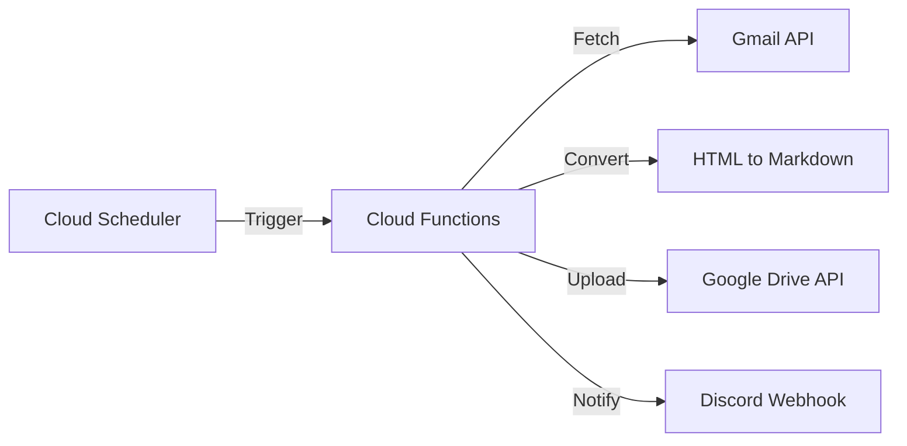

# auto-gmail-uploader

A workflow that automatically converts specific Gmail newsletters into Markdown format
and uploads them to designated folders in Google Drive.

## Purpose

The primary goal of this project is to automate the archiving of valuable newsletter content
into Google Drive as machine-readable Markdown files. By converting HTML emails into
structured Markdown, you can seamlessly leverage AI-powered tools such as
**Google Gemini** or **NotebookLM** to summarize, analyze, and gain deeper insights
from your accumulated subscription history.

## Features

- **Automatic Conversion**: Organizes HTML email layouts into readable Markdown.
- **Footer Truncation**: Automatically removes unnecessary newsletter footers (unsubscribe links, etc.).
- **Serverless**: Powered by Google Cloud Functions and Cloud Scheduler, costing nearly $0/month.
- **Notifications**: Notifies success or failure via Discord Webhook.

## System Architecture



## Directory Structure

- `src/`: Cloud Functions source code
- `infra/`: Infrastructure definitions via Terraform
- `configs/`: Newsletter configurations (search queries, folder IDs)
- `scripts/`: Initialization and secret management scripts
- `tests/`: Unit and integration tests

## Setup Instructions

Detailed steps can be found in [docs/setup/gcp-manual-setup.md](docs/setup/gcp-manual-setup.md).

### 1. Google Cloud Manual Preparation

- Create a project and enable APIs (Gmail, Drive, Secret Manager, Cloud Functions, Cloud Run, Cloud Build).
- Configure the OAuth consent screen and add test users.
- Create OAuth 2.0 Client ID (Desktop App) and download `client_secret.json`.

### 2. Obtain Initial Token

```bash
# Place client_secret.json in the project root
uv run scripts/get_refresh_token.py
# Note down the displayed Refresh Token
```

### 3. Configure Environment Variables

Create a `.env` file and fill in the tokens.

```env
GCP_CLIENT_ID="..."
GCP_CLIENT_SECRET="..."
GCP_REFRESH_TOKEN="..."
DISCORD_WEBHOOK_URL="..."
```

### 4. Deploy Infrastructure (Terraform)

```bash
cd infra
# Create terraform.tfvars (with project_id, region)
terraform init
terraform apply
```

### 5. Synchronize Secrets

```bash
uv run scripts/update_secrets.py
```

## Development and Testing

- **Run Tests**: `uv run python -m pytest`
- **Run Locally**: `uv run python -m src.main`
