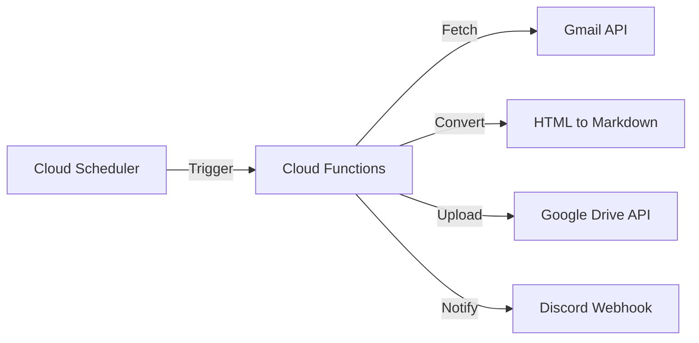

# auto-gmail-uploader

A workflow that automatically converts specific Gmail newsletters into Markdown format
and uploads them to designated folders in Google Drive.

## Purpose

The primary goal of this project is to automate the archiving of valuable newsletter content
into Google Drive as machine-readable Markdown files. By converting HTML emails into
structured Markdown, you can seamlessly leverage AI-powered tools such as
**Google Gemini** or **NotebookLM** to summarize, analyze, and gain deeper insights
from your accumulated subscription history.

## Features

- **Automatic Conversion**: Organizes HTML email layouts into readable Markdown.
- **Footer Truncation**: Automatically removes unnecessary newsletter footers (unsubscribe links, etc.).
- **Serverless**: Powered by Google Cloud Functions and Cloud Scheduler, costing nearly $0/month.
- **Notifications**: Notifies success or failure via Discord Webhook.

## System Architecture

```mermaid
graph LR
    Scheduler[Cloud Scheduler] -->|Trigger| GCF[Cloud Functions]
    GCF -->|Fetch| GmailAPI[Gmail API]
    GCF -->|Convert| MD[HTML to Markdown]
    GCF -->|Upload| DriveAPI[Google Drive API]
    GCF -->|Notify| Discord[Discord Webhook]
```

## Directory Structure

- `src/`: Cloud Functions source code
- `infra/`: Infrastructure definitions via Terraform
- `configs/`: Newsletter configurations (search queries, folder IDs)
- `scripts/`: Initialization and secret management scripts
- `tests/`: Unit and integration tests

## Setup Instructions

Detailed steps to set up and deploy this project can be found in [docs/setup/README.md](docs/setup/README.md).

## Development and Testing

- **Run Tests**: `uv run python -m pytest`
- **Run Locally**: `uv run python -m src.main`
